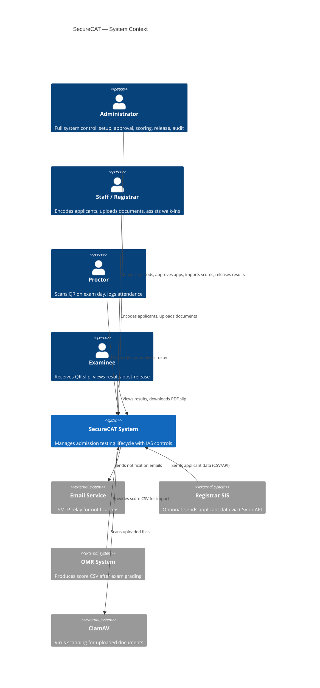

# 01 — System Context Diagram

> Who interacts with SecureCAT and what external systems does it touch?

---

## Context Diagram



---

## Actors

| Actor | Role in System | Introduced In |
|-------|---------------|---------------|
| **Administrator** | Full access. Creates semesters, courses, sessions, rooms. Reviews and approves applications. Imports scores. Releases results. Manages users, audit logs, security settings. | Phase 1 |
| **Staff / Registrar** | Encodes walk-in applicants. Uploads documents. Performs CSV bulk import. Responds to admin revision requests. Cannot approve applications or release results independently. | Phase 1 |
| **Proctor** | Assigned to exam sessions. Scans QR codes on exam day. Views assigned roster and attendance. Reports anomalies. Permissions scoped to assigned sessions. | Phase 1 |
| **Examinee** | Receives printed QR admission slip. Presents QR on exam day. Views own results after release. Downloads PDF result slip. Does not self-register in Phase 1 (registrar encodes for them). | Phase 3 (result viewing) |

---

## External Systems

| System | Interaction | Data Exchanged | Phase |
|--------|-------------|----------------|-------|
| **Email Service (SMTP)** | SecureCAT sends emails for notifications | Application status changes, result availability, revision requests | Phase 2 |
| **Registrar SIS** | SIS pushes applicant data to SecureCAT via CSV file or REST API | Applicant personal details, course choice | Phase 2 |
| **OMR Scoring System** | Admin exports score CSV from OMR software and imports into SecureCAT | Applicant ID / seat number, raw scores | Phase 3 |
| **ClamAV (Antivirus)** | SecureCAT sends uploaded files for virus scanning | File bytes -> clean/infected result | Phase 2 |

---

## Trust Boundaries

```
+---------------------------------------------------------------+
|  TRUSTED ZONE (Server-Side)                                   |
|  - Application logic, database, file storage, audit log       |
|  - All data validated and authorized before processing        |
+---------------------------------------------------------------+
        |            |             |              |
      HTTPS        HTTPS        HTTPS          HTTPS
        |            |             |              |
+----------+  +---------+  +-----------+  +------------+
| Admin    |  | Staff   |  | Proctor   |  | Examinee   |
| Browser  |  | Browser |  | Mobile    |  | Browser    |
+----------+  +---------+  +-----------+  +------------+
  UNTRUSTED     UNTRUSTED    UNTRUSTED      UNTRUSTED

+---------------------------------------------------------------+
|  EXTERNAL SYSTEMS (varying trust)                             |
|  - Email SMTP: trusted (configured by admin)                  |
|  - Registrar SIS API: semi-trusted (authenticated, validated) |
|  - OMR CSV: semi-trusted (checksum verified)                  |
|  - ClamAV: trusted (local service)                            |
+---------------------------------------------------------------+
```

All data crossing the trust boundary (browser -> server) is:
- Authenticated (session/token check)
- Authorized (RBAC permission check)
- Validated (input type, format, length, range)
- Logged (audit record created)
