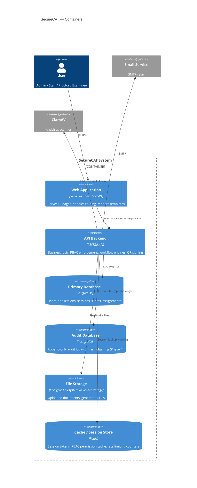

# 02 — Container Diagram

> What deployable units make up SecureCAT?

---

## Container Diagram



---

## Container Details

### Web Application

| Attribute | Value |
|-----------|-------|
| **Purpose** | Serves the user interface (HTML pages or SPA shell). Routes requests to the API backend. |
| **Deployment** | Behind a reverse proxy (e.g., Nginx) with TLS termination. |
| **Security** | HTTPS only. CSRF tokens on forms. Content Security Policy headers. X-Frame-Options: DENY. |
| **Phase** | Phase 1 |

> If the team uses a monolithic framework (e.g., Laravel, Django), the Web Application and API Backend may be a single deployable unit. The logical separation still applies.

### API Backend

| Attribute | Value |
|-----------|-------|
| **Purpose** | All business logic: auth, RBAC, application workflow, QR signing/verification, scoring, result release, audit logging. |
| **Key services** | AuthService, RBACMiddleware, ApplicationWorkflow, QRService, ScoringService, ResultService, AuditLogger, NotificationService |
| **Security** | Every request authenticated + authorized. All inputs validated. All mutations logged. |
| **Phase** | Phase 1 (core services); expanded in Phases 2-4 |

### Primary Database (PostgreSQL)

| Attribute | Value |
|-----------|-------|
| **Purpose** | Persistent storage for all operational data. |
| **Security** | Encrypted connections (SSL mode). Encrypted at rest (pgcrypto or filesystem encryption). Role-based DB users (app user has limited privileges). |
| **Backup** | Daily encrypted backups. Point-in-time recovery enabled. |
| **Phase** | Phase 1 |

### Audit Database (PostgreSQL)

| Attribute | Value |
|-----------|-------|
| **Purpose** | Dedicated store for audit log records. Separate from primary to enforce append-only constraints independently. |
| **Security** | Append-only (INSERT only; no UPDATE/DELETE — enforced by DB permissions or triggers in Phase 4). Hash-chained records (Phase 4). Encrypted connections and at-rest. |
| **Retention** | 7+ years. Archival to compressed, encrypted files after configurable period. |
| **Phase** | Phase 1 (same DB, separate table); Phase 4 (dedicated instance + hash-chaining) |

> In Phase 1, the audit log may reside in the same PostgreSQL instance as the primary database (separate schema or table). Phase 4 upgrades to a dedicated instance with enforced append-only behavior.

### File Storage

| Attribute | Value |
|-----------|-------|
| **Purpose** | Stores uploaded documents (PDF, JPG, PNG), generated QR admission slips, and PDF result slips. |
| **Security** | Encrypted at rest. Access controlled via application (no direct URL access). Virus scanning on upload. File paths are non-guessable (UUID-based). |
| **Phase** | Phase 2 (document upload); Phase 3 (PDF result slips) |

### Cache / Session Store (Redis)

| Attribute | Value |
|-----------|-------|
| **Purpose** | Session token storage with TTL. RBAC permission caching (avoids DB lookup on every request). Rate limiting counters (API intake, login attempts). |
| **Security** | Password-protected. Bound to localhost or internal network only. TLS if remote. |
| **Phase** | Phase 1 |

---

## Deployment Topology (Simplified)

```
+--------------------------------------------------+
|  Server (Production)                             |
|                                                  |
|  +--------+     +------------------+             |
|  | Nginx  |---->| Web App + API    |             |
|  | (TLS)  |     | (single process) |             |
|  +--------+     +--------+---------+             |
|                          |                       |
|            +-------------+-------------+         |
|            |             |             |         |
|     +------+---+  +-----+----+  +-----+---+    |
|     | PostgreSQL|  |  Redis   |  | File    |    |
|     | (primary  |  | (session |  | Storage |    |
|     |  + audit) |  |  + cache)|  | (local) |    |
|     +----------+  +----------+  +---------+    |
|                                                  |
+--------------------------------------------------+
```

Phase 4 may split the audit database to a separate instance and introduce a secondary server for redundancy, but the initial deployment is a single server.
