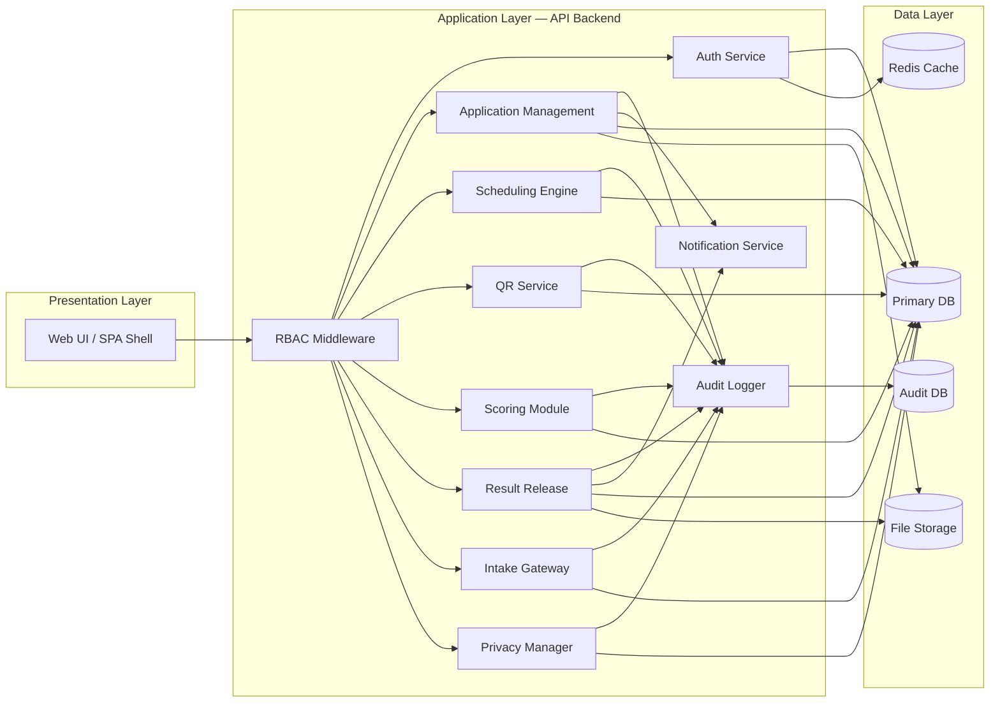

# 03 — Component Diagram

> What logical modules live inside the API backend?

---

## Component Map

---

## Component Details

### Auth Service

| Attribute | Value |
|-----------|-------|
| **Responsibility** | User registration, login, session management, password hashing, MFA verification (Phase 4). |
| **Inputs** | Credentials (email + password), TOTP code (Phase 4). |
| **Outputs** | Session token (stored in Redis), authenticated user context. |
| **Security** | bcrypt/argon2 hashing. Session tokens with configurable TTL. Brute-force protection via rate limiting. |
| **Phase** | Phase 1 (basic auth); Phase 4 (MFA) |

### RBAC Middleware

| Attribute | Value |
|-----------|-------|
| **Responsibility** | Intercepts every request. Verifies session validity. Checks user's role against the required permission for the route/action. Rejects unauthorized requests (403). |
| **Access Control Matrix** | See [icat-system.md Section 5.3](../../icat-system.md) for the full matrix. |
| **Caching** | Permission lookups cached in Redis; invalidated on role change. |
| **Phase** | Phase 1 |

### Application Management

| Attribute | Value |
|-----------|-------|
| **Responsibility** | CRUD for applicants and applications. State machine: `draft` -> `pending_review` -> `approved` / `rejected` / `revision_requested`. Document attachment (Phase 2). |
| **Key operations** | Create applicant (staff), submit application, admin approve/reject/request-revision, assign to exam session. |
| **Audit** | Every state transition logged. |
| **Phase** | Phase 1 (core workflow); Phase 2 (documents, enhanced diffs) |

### Scheduling Engine

| Attribute | Value |
|-----------|-------|
| **Responsibility** | CRUD for admission periods, courses, rooms, exam sessions. Proctor assignment. Applicant-to-session assignment with capacity checks. |
| **Key operations** | Create period, add course, create session, assign proctor, assign applicant (checks capacity). |
| **Phase** | Phase 1 |

### QR Service

| Attribute | Value |
|-----------|-------|
| **Responsibility** | Generates HMAC-SHA256 signed QR payloads after applicant assignment. Verifies QR on proctor scan. Detects anomalies (wrong room, time, duplicate). |
| **Key operations** | `generateQR(assignment)` -> signed payload. `validateQR(payload)` -> result + anomalies. |
| **Offline** | Phase 4 adds offline validation with cached roster. |
| **Phase** | Phase 1 (online); Phase 4 (offline) |

### Intake Gateway

| Attribute | Value |
|-----------|-------|
| **Responsibility** | Handles all application intake channels: manual form (Phase 1), CSV bulk import (Phase 2), REST API endpoint (Phase 2). All channels feed the same approval queue. |
| **Key operations** | `encodeManual(data)`, `importCSV(file)`, `receiveAPI(payload)`. All produce applications in `pending_review`. |
| **Validation** | Format, required fields, duplicates, course existence. Preview + review-before-commit for CSV and API. |
| **Phase** | Phase 1 (manual only); Phase 2 (CSV + API) |

### Scoring Module

| Attribute | Value |
|-----------|-------|
| **Responsibility** | OMR score import with checksum verification. Score calculation from answer keys. Manual entry/correction with justification. Score history tracking. |
| **Key operations** | `importScores(csv)`, `calculateScores(answerKey, responses)`, `correctScore(id, newValue, justification)`. |
| **Phase** | Phase 3 |

### Result Release

| Attribute | Value |
|-----------|-------|
| **Responsibility** | Controls when scores become visible. Two-step: mark-ready -> release. Generates PDF result slips. Logs all result access. |
| **Key operations** | `markReady(session)`, `release(session)`, `generatePDF(score)`, `logAccess(score, accessor)`. |
| **Phase** | Phase 3 |

### Audit Logger

| Attribute | Value |
|-----------|-------|
| **Responsibility** | Receives audit events from all other components. Writes immutable records. Phase 1: simple records. Phase 2: before/after diffs. Phase 4: hash-chained, append-only, with verification tooling. |
| **Interface** | `log(userId, role, action, entityType, entityId, details, beforeValue?, afterValue?)` |
| **Storage** | Writes to audit table (Phase 1-3: same DB; Phase 4: dedicated instance). |
| **Phase** | Phase 1 (foundation); Phase 2 (diffs); Phase 4 (hash-chain) |

### Notification Service

| Attribute | Value |
|-----------|-------|
| **Responsibility** | Sends emails and creates in-app notification records. Triggered by workflow events (approval, rejection, revision request, result release). |
| **Channels** | Email (SMTP), in-app (Notification table). |
| **Phase** | Phase 2 |

### Privacy Manager

| Attribute | Value |
|-----------|-------|
| **Responsibility** | Data subject search, anonymization, export, consent management. Handles right-to-erasure and right-to-portability requests. |
| **Key operations** | `searchApplicant(query)`, `anonymize(applicantId)`, `exportData(applicantId)`. |
| **Phase** | Phase 4 |
