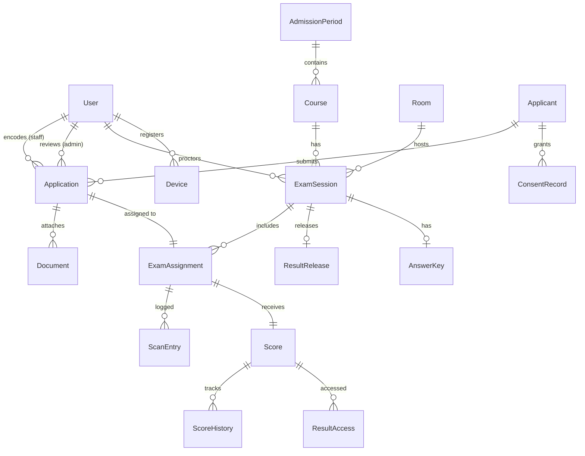
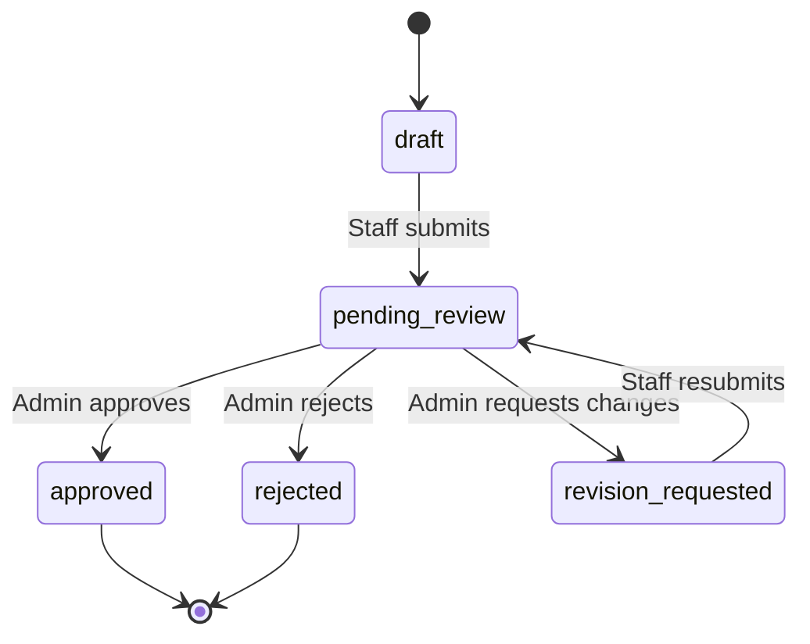

# 04 — Data Model

> Core entities, relationships, and lifecycle states.

---

## Entity-Relationship Overview

---

## Entity Catalog

Each entity includes its **introduction phase** and key fields. Fields marked with a lock icon are encrypted at rest.

### User

| Field | Type | Notes | Phase |
|-------|------|-------|-------|
| `id` | UUID / BIGINT | Primary key | 1 |
| `email` | VARCHAR(255) | Unique, used for login | 1 |
| `password_hash` | VARCHAR(255) | bcrypt or argon2 | 1 |
| `role` | ENUM (admin, staff, proctor, examinee) | Determines permissions | 1 |
| `first_name` | VARCHAR(100) | | 1 |
| `last_name` | VARCHAR(100) | | 1 |
| `is_active` | BOOLEAN | Soft-disable accounts | 1 |
| `mfa_secret` | VARCHAR(255) | TOTP secret (encrypted) | 4 |
| `mfa_enabled` | BOOLEAN | | 4 |
| `recovery_codes` | TEXT | Encrypted JSON array | 4 |
| `created_at` | TIMESTAMP | | 1 |
| `updated_at` | TIMESTAMP | | 1 |

### AdmissionPeriod

| Field | Type | Notes | Phase |
|-------|------|-------|-------|
| `id` | UUID / BIGINT | | 1 |
| `name` | VARCHAR(255) | e.g., "2nd Semester AY 2026-2027" | 1 |
| `start_date` | DATE | Application window opens | 1 |
| `end_date` | DATE | Application window closes | 1 |
| `status` | ENUM (draft, active, closed) | | 1 |
| `created_by` | FK -> User | | 1 |
| `created_at` | TIMESTAMP | | 1 |

### Course

| Field | Type | Notes | Phase |
|-------|------|-------|-------|
| `id` | UUID / BIGINT | | 1 |
| `admission_period_id` | FK -> AdmissionPeriod | | 1 |
| `name` | VARCHAR(255) | e.g., "BS Information Technology" | 1 |
| `code` | VARCHAR(20) | e.g., "BSIT" | 1 |
| `description` | TEXT | | 1 |
| `created_at` | TIMESTAMP | | 1 |

### Room

| Field | Type | Notes | Phase |
|-------|------|-------|-------|
| `id` | UUID / BIGINT | | 1 |
| `name` | VARCHAR(100) | e.g., "Room 101" | 1 |
| `capacity` | INTEGER | Maximum examinees | 1 |
| `location_notes` | TEXT | Floor, building, accessibility | 1 |
| `created_at` | TIMESTAMP | | 1 |

### ExamSession

| Field | Type | Notes | Phase |
|-------|------|-------|-------|
| `id` | UUID / BIGINT | | 1 |
| `course_id` | FK -> Course | | 1 |
| `room_id` | FK -> Room | | 1 |
| `proctor_id` | FK -> User | Proctor assigned | 1 |
| `date` | DATE | Exam date | 1 |
| `start_time` | TIME | | 1 |
| `end_time` | TIME | | 1 |
| `status` | ENUM (scheduled, in_progress, completed) | | 1 |
| `scoring_status` | ENUM (pending, imported, reviewed, released) | | 3 |
| `pass_threshold` | INTEGER | Nullable; minimum passing score | 3 |
| `created_at` | TIMESTAMP | | 1 |

### Applicant

| Field | Type | Notes | Phase |
|-------|------|-------|-------|
| `id` | UUID / BIGINT | | 1 |
| `first_name` | VARCHAR(100) | | 1 |
| `last_name` | VARCHAR(100) | | 1 |
| `email` | VARCHAR(255) | Nullable (walk-in may not have) | 1 |
| `contact_number` | VARCHAR(20) | | 1 |
| `date_of_birth` | DATE | | 1 |
| `address` | TEXT | | 1 |
| `photo_path` | VARCHAR(500) | Optional photo for verification | 2 |
| `encoded_by` | FK -> User | Staff who encoded | 1 |
| `is_anonymized` | BOOLEAN | Default false; Phase 4 privacy | 4 |
| `created_at` | TIMESTAMP | | 1 |

### Application

| Field | Type | Notes | Phase |
|-------|------|-------|-------|
| `id` | UUID / BIGINT | | 1 |
| `applicant_id` | FK -> Applicant | | 1 |
| `course_id` | FK -> Course | First preferred course (required) | 1 |
| `second_course_id` | FK -> Course | Second preferred course (optional) | 1 |
| `third_course_id` | FK -> Course | Third preferred course (optional) | 1 |
| `admission_period_id` | FK -> AdmissionPeriod | | 1 |
| `status` | ENUM (draft, pending_review, approved, rejected, revision_requested) | State machine | 1 |
| `intake_source` | ENUM (manual, csv_import, api) | How the application entered | 2 |
| `admin_notes` | TEXT | Reason for rejection/revision | 1 |
| `reviewed_by` | FK -> User | Admin who reviewed | 1 |
| `reviewed_at` | TIMESTAMP | | 1 |
| `created_at` | TIMESTAMP | | 1 |
| `updated_at` | TIMESTAMP | | 1 |

**State Machine:**

### ExamAssignment

| Field | Type | Notes | Phase |
|-------|------|-------|-------|
| `id` | UUID / BIGINT | | 1 |
| `application_id` | FK -> Application | | 1 |
| `exam_session_id` | FK -> ExamSession | | 1 |
| `seat_number` | VARCHAR(10) | Optional | 1 |
| `qr_payload` | TEXT | JSON: applicant_id, exam_session_id, room_id, schedule, generated_at | 1 |
| `qr_signature` | VARCHAR(64) | HMAC-SHA256 hex string | 1 |
| `assigned_at` | TIMESTAMP | | 1 |

### ScanEntry

| Field | Type | Notes | Phase |
|-------|------|-------|-------|
| `id` | UUID / BIGINT | | 1 |
| `exam_assignment_id` | FK -> ExamAssignment | | 1 |
| `proctor_id` | FK -> User | | 1 |
| `scanned_at` | TIMESTAMP | | 1 |
| `device_info` | TEXT | User-agent, device fingerprint | 1 |
| `validation_result` | ENUM (valid, invalid) | | 1 |
| `failure_reason` | VARCHAR(255) | Null if valid | 1 |

### Document (Phase 2)

| Field | Type | Notes | Phase |
|-------|------|-------|-------|
| `id` | UUID / BIGINT | | 2 |
| `application_id` | FK -> Application | | 2 |
| `file_name` | VARCHAR(255) | Original filename | 2 |
| `file_path` | VARCHAR(500) | UUID-based path in file store | 2 |
| `file_size` | INTEGER | Bytes | 2 |
| `mime_type` | VARCHAR(50) | application/pdf, image/jpeg, image/png | 2 |
| `uploaded_by` | FK -> User | | 2 |
| `uploaded_at` | TIMESTAMP | | 2 |
| `scan_status` | ENUM (pending, clean, infected) | ClamAV result | 2 |
| `verification_status` | ENUM (pending, verified, reupload_requested) | | 2 |
| `admin_notes` | TEXT | Reason for re-upload request | 2 |

### ImportBatch (Phase 2)

| Field | Type | Notes | Phase |
|-------|------|-------|-------|
| `id` | UUID / BIGINT | | 2 |
| `type` | ENUM (applicant_csv, score_omr) | Reused for Phase 3 score import | 2 |
| `uploaded_by` | FK -> User | | 2 |
| `file_name` | VARCHAR(255) | | 2 |
| `file_checksum` | VARCHAR(64) | SHA-256 | 2 |
| `row_count` | INTEGER | | 2 |
| `success_count` | INTEGER | | 2 |
| `error_count` | INTEGER | | 2 |
| `status` | ENUM (pending, committed, discarded) | | 2 |
| `created_at` | TIMESTAMP | | 2 |

### ImportBatchRow (Phase 2)

| Field | Type | Notes | Phase |
|-------|------|-------|-------|
| `id` | UUID / BIGINT | | 2 |
| `import_batch_id` | FK -> ImportBatch | | 2 |
| `row_number` | INTEGER | Position in CSV | 2 |
| `raw_data` | JSON | Original row as key-value | 2 |
| `validation_status` | ENUM (valid, warning, error) | | 2 |
| `validation_messages` | JSON | Array of messages | 2 |
| `application_id` | FK -> Application | Null until committed | 2 |

### Notification (Phase 2)

| Field | Type | Notes | Phase |
|-------|------|-------|-------|
| `id` | UUID / BIGINT | | 2 |
| `user_id` | FK -> User | Recipient | 2 |
| `type` | VARCHAR(50) | e.g., application_approved, document_reupload | 2 |
| `title` | VARCHAR(255) | | 2 |
| `message` | TEXT | | 2 |
| `entity_type` | VARCHAR(50) | e.g., application, document | 2 |
| `entity_id` | UUID / BIGINT | | 2 |
| `is_read` | BOOLEAN | | 2 |
| `created_at` | TIMESTAMP | | 2 |

### Score (Phase 3)

| Field | Type | Notes | Phase |
|-------|------|-------|-------|
| `id` | UUID / BIGINT | | 3 |
| `exam_assignment_id` | FK -> ExamAssignment | | 3 |
| `raw_score` | INTEGER | Points earned | 3 |
| `total_items` | INTEGER | Maximum possible | 3 |
| `percentage` | DECIMAL(5,2) | Computed | 3 |
| `is_passing` | BOOLEAN | Computed from threshold | 3 |
| `imported_from_batch_id` | FK -> ImportBatch | Null if manual entry | 3 |
| `created_at` | TIMESTAMP | | 3 |
| `updated_at` | TIMESTAMP | | 3 |

### ScoreHistory (Phase 3)

| Field | Type | Notes | Phase |
|-------|------|-------|-------|
| `id` | UUID / BIGINT | | 3 |
| `score_id` | FK -> Score | | 3 |
| `old_value` | INTEGER | Previous raw_score | 3 |
| `new_value` | INTEGER | Updated raw_score | 3 |
| `changed_by` | FK -> User | | 3 |
| `justification` | TEXT | Required, non-empty | 3 |
| `changed_at` | TIMESTAMP | | 3 |

### AnswerKey (Phase 3)

| Field | Type | Notes | Phase |
|-------|------|-------|-------|
| `id` | UUID / BIGINT | | 3 |
| `exam_session_id` | FK -> ExamSession | | 3 |
| `data_encrypted` | TEXT | Encrypted JSON blob with answers | 3 |
| `created_by` | FK -> User | | 3 |
| `created_at` | TIMESTAMP | | 3 |

### ResultRelease (Phase 3)

| Field | Type | Notes | Phase |
|-------|------|-------|-------|
| `id` | UUID / BIGINT | | 3 |
| `exam_session_id` | FK -> ExamSession | | 3 |
| `released_by` | FK -> User | | 3 |
| `released_at` | TIMESTAMP | | 3 |
| `applicant_count` | INTEGER | Number of results released | 3 |

### ResultAccess (Phase 3)

| Field | Type | Notes | Phase |
|-------|------|-------|-------|
| `id` | UUID / BIGINT | | 3 |
| `score_id` | FK -> Score | | 3 |
| `accessor_type` | ENUM (examinee, staff, admin) | | 3 |
| `accessor_identifier` | VARCHAR(255) | Email or user_id | 3 |
| `action` | ENUM (view, download_pdf) | | 3 |
| `ip_address` | VARCHAR(45) | | 3 |
| `accessed_at` | TIMESTAMP | | 3 |

### AuditLog (Evolving)

| Field | Type | Notes | Phase |
|-------|------|-------|-------|
| `id` | BIGINT (auto-increment) | Sequential for chain ordering | 1 |
| `user_id` | FK -> User | Who | 1 |
| `role` | VARCHAR(20) | Role at time of action | 1 |
| `action` | VARCHAR(100) | e.g., application.approve, score.import | 1 |
| `entity_type` | VARCHAR(50) | e.g., Application, Score | 1 |
| `entity_id` | VARCHAR(50) | | 1 |
| `ip_address` | VARCHAR(45) | | 1 |
| `timestamp` | TIMESTAMP | UTC | 1 |
| `details` | JSON | Additional context | 1 |
| `before_value` | JSON | Nullable; field-level diff | 2 |
| `after_value` | JSON | Nullable; field-level diff | 2 |
| `previous_hash` | VARCHAR(64) | SHA-256 of previous record | 4 |
| `current_hash` | VARCHAR(64) | SHA-256 of this record | 4 |

### Device (Phase 4)

| Field | Type | Notes | Phase |
|-------|------|-------|-------|
| `id` | UUID / BIGINT | | 4 |
| `user_id` | FK -> User | Proctor | 4 |
| `fingerprint` | VARCHAR(255) | Device identifier | 4 |
| `description` | VARCHAR(255) | "Samsung Tab A, Room 101" | 4 |
| `status` | ENUM (pending, approved, revoked) | | 4 |
| `approved_by` | FK -> User | Admin | 4 |
| `approved_at` | TIMESTAMP | | 4 |
| `last_used_at` | TIMESTAMP | | 4 |

### OfflineScanQueue (Phase 4)

| Field | Type | Notes | Phase |
|-------|------|-------|-------|
| `id` | UUID / BIGINT | | 4 |
| `device_id` | FK -> Device | | 4 |
| `exam_assignment_id` | FK -> ExamAssignment | | 4 |
| `scanned_at_local` | TIMESTAMP | Device-local time | 4 |
| `qr_payload` | TEXT | Raw payload scanned | 4 |
| `validation_result` | ENUM (valid, invalid) | Local validation | 4 |
| `synced` | BOOLEAN | | 4 |
| `synced_at` | TIMESTAMP | Null until synced | 4 |

### ConsentRecord (Phase 4)

| Field | Type | Notes | Phase |
|-------|------|-------|-------|
| `id` | UUID / BIGINT | | 4 |
| `applicant_id` | FK -> Applicant | | 4 |
| `consent_type` | VARCHAR(50) | e.g., data_processing, result_publication | 4 |
| `granted_at` | TIMESTAMP | | 4 |
| `withdrawn_at` | TIMESTAMP | Nullable | 4 |
| `ip_address` | VARCHAR(45) | | 4 |

### DataRetentionPolicy (Phase 4)

| Field | Type | Notes | Phase |
|-------|------|-------|-------|
| `id` | UUID / BIGINT | | 4 |
| `entity_type` | VARCHAR(50) | e.g., Applicant, Score, AuditLog | 4 |
| `retention_days` | INTEGER | | 4 |
| `action` | ENUM (anonymize, delete) | | 4 |
| `is_active` | BOOLEAN | | 4 |
