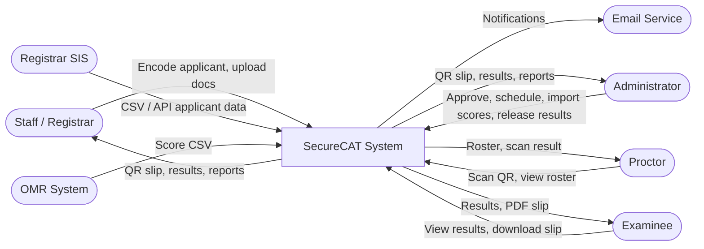

# 06 — Data Flow Diagrams & Trust Boundaries

> How data moves through SecureCAT, and where validation/authorization gates exist.

---

## 1. Level 0 — System Context DFD



---

## 2. Level 1 — Internal Process DFD


---

## 3. Trust Boundaries Detail

### Boundary 1: Browser to Server

| Property | Value |
|----------|-------|
| **Where** | Between any user's browser/device and the Nginx reverse proxy |
| **Protocol** | HTTPS (TLS 1.2+) |
| **Validation at boundary** | Session/token authentication, RBAC permission check, CSRF token verification, input validation (type, length, format, allowed values) |
| **Threats mitigated** | Spoofing (unauthenticated access), tampering (malformed input), elevation of privilege (unauthorized actions) |

### Boundary 2: Server to Primary Database

| Property | Value |
|----------|-------|
| **Where** | Between API backend and PostgreSQL |
| **Protocol** | PostgreSQL wire protocol over TLS |
| **Validation at boundary** | Parameterized queries (prevent SQL injection), DB-level role permissions (app user cannot DROP tables), encrypted connection |
| **Threats mitigated** | SQL injection, unauthorized direct DB access, data interception |

### Boundary 3: Server to Audit Database

| Property | Value |
|----------|-------|
| **Where** | Between Audit Logger component and audit PostgreSQL (same or separate instance) |
| **Protocol** | PostgreSQL wire protocol over TLS |
| **Validation at boundary** | INSERT-only permissions (no UPDATE/DELETE — Phase 4). Hash-chain integrity (Phase 4). |
| **Threats mitigated** | Audit log tampering, record deletion |

### Boundary 4: Server to File Storage

| Property | Value |
|----------|-------|
| **Where** | Between API backend and encrypted file system / object storage |
| **Protocol** | Filesystem API or S3-compatible API |
| **Validation at boundary** | File type validation (MIME + extension), size limit, virus scan (ClamAV), non-guessable UUID paths |
| **Threats mitigated** | Malicious file upload, unauthorized file access, path traversal |

### Boundary 5: External System to Server (API Intake)

| Property | Value |
|----------|-------|
| **Where** | Between Registrar SIS and the Intake Gateway API endpoint |
| **Protocol** | HTTPS |
| **Validation at boundary** | API key/token authentication, rate limiting, input validation (same rules as manual entry), review-before-commit pattern |
| **Threats mitigated** | Unauthorized data injection, spam/flood, malformed data |

### Boundary 6: Server to Email Service

| Property | Value |
|----------|-------|
| **Where** | Between Notification Service and SMTP relay |
| **Protocol** | SMTP with STARTTLS |
| **Validation at boundary** | Outbound only — no inbound data from email service affects system state. Template-based email prevents injection. |
| **Threats mitigated** | Email injection, information disclosure (templates don't include sensitive data beyond what's necessary) |

---

## 4. Data Flow — Application Lifecycle

This traces a single application from encoding to exam-day scanning:

```
1. Staff encodes applicant data via browser form
   |
   v
2. HTTPS request -> Nginx (TLS termination)
   |
   v
3. Auth middleware: validate session, check role = staff
   |
   v
4. RBAC middleware: verify staff can access /api/applicants (POST)
   |
   v
5. Input validation: all fields checked (type, length, format)
   |
   v
6. Application Management: create Applicant + Application (status=pending_review)
   |
   v
7. Audit Logger: log(staff_id, "application.create", Application, new_id)
   |
   v
8. Response to staff: "Application #1234 created"

--- Admin reviews ---

9. Admin opens approval queue -> GET /api/applications?status=pending_review
   (Auth + RBAC checked)
   |
   v
10. Admin approves: POST /api/applications/1234/approve
    |
    v
11. Application status -> approved
    Audit Logger: log(admin_id, "application.approve", Application, 1234)
    |
    v
12. Scheduling Engine: assign to ExamSession (capacity check)
    |
    v
13. QR Service: generate HMAC-SHA256 signed payload
    Store qr_payload + qr_signature in ExamAssignment
    Audit Logger: log(admin_id, "assignment.create", ExamAssignment, new_id)

--- Exam Day ---

14. Proctor scans QR via camera -> POST /api/scan (payload)
    |
    v
15. Auth + RBAC: proctor authenticated, assigned to this session
    |
    v
16. QR Service: extract payload, recalculate HMAC, compare signatures
    Check: correct session? correct room? within time window? already scanned?
    |
    v
17. If valid: create ScanEntry (valid), return green checkmark
    If invalid: create ScanEntry (invalid, reason), return red alert
    |
    v
18. Audit Logger: log(proctor_id, "scan.validate", ScanEntry, new_id)
```

---

## 5. Data Flow — Score Import to Result Release

```
1. Admin uploads OMR CSV -> POST /api/scoring/:session_id/import
   |
   v
2. Auth + RBAC: admin only
   |
   v
3. System computes SHA-256 checksum of file, stores it
   |
   v
4. Validate CSV: format, required columns, data types, applicant ID mapping
   |
   v
5. Preview shown to admin (green/yellow/red rows)
   |
   v
6. Admin commits -> scores written to Score table
   Audit: log(admin_id, "score.import", ScoreImportBatch, batch_id)
   |
   v
7. Admin reviews score dashboard (distribution, pass/fail)
   |
   v
8. Admin marks session "ready for release"
   Audit: log(admin_id, "result.mark_ready", ExamSession, session_id)
   |
   v
9. Admin (or second admin) clicks "Release Results"
   -> ResultRelease record created (immutable)
   Audit: log(admin_id, "result.release", ResultRelease, release_id)
   |
   v
10. Notification Service: email examinees (if email available)
   |
   v
11. Examinee accesses result portal -> POST /api/results/lookup
    -> System checks: ResultRelease exists? -> Yes -> return score
    -> ResultAccess record created
    -> Examinee downloads PDF -> ResultAccess (download_pdf) logged
```
