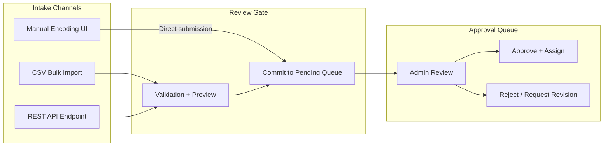
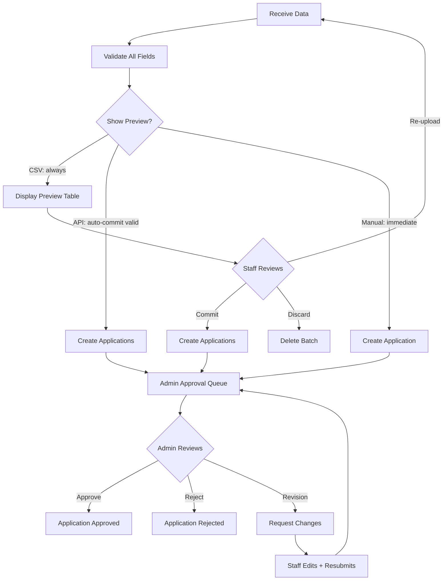

# 07 — External Interfaces

> Registrar intake contracts: manual UI, CSV import, API endpoint, and the review-before-commit pattern.

---

## 1. Intake Architecture

All application intake channels feed a single approval queue. The admin always reviews before an application becomes active.



**Key principle:** CSV and API intake always go through a **review-before-commit** step. Staff (for CSV) or the system (for API) sees a validation preview before any data enters the approval queue. This prevents bad data from polluting the workflow.

---

## 2. Manual Encoding UI (Phase 1)

### Description

Staff fills out a web form to create an applicant and application. This is the baseline intake channel.

### Form Fields

| Field | Type | Required | Validation |
|-------|------|----------|------------|
| `first_name` | Text | Yes | 1-100 characters, letters + spaces + hyphens |
| `last_name` | Text | Yes | 1-100 characters, letters + spaces + hyphens |
| `email` | Email | No | Valid email format if provided |
| `contact_number` | Text | No | Digits, dashes, plus sign; 7-20 characters |
| `date_of_birth` | Date | Yes | Valid date, not in future, age >= 15 |
| `address` | Textarea | No | Max 500 characters |
| `first_course_code` | Select | Yes | First preferred course; must match an active course in the current period |
| `second_course_code` | Select | No | Second preferred course; if provided, must match active course and differ from first |
| `third_course_code` | Select | No | Third preferred course; if provided, must match active course and differ from first and second |

### Behavior

1. Staff fills out the form and clicks "Submit."
2. Server validates all fields.
3. If valid: creates `Applicant` + `Application` (status = `pending_review`). Returns confirmation.
4. If invalid: returns field-level error messages. Form re-displays with entered values preserved.
5. Audit record created for `application.create`.

---

## 3. CSV Bulk Import (Phase 2)

### CSV Template

Staff downloads a template CSV. The first row is headers; data starts on row 2.

```csv
first_name,last_name,email,contact_number,date_of_birth,address,first_course_code,second_course_code,third_course_code
Juan,Dela Cruz,juan@email.com,09171234567,2005-03-15,"123 Main St, Urdaneta",BSIT,BSCS,
Maria,Santos,,09181234567,2004-11-22,"456 Elm St, Dagupan",BSCS,,
```

### Column Specification

| Column | Required | Format | Validation |
|--------|----------|--------|------------|
| `first_name` | Yes | Text | 1-100 chars |
| `last_name` | Yes | Text | 1-100 chars |
| `email` | No | Email | Valid format if present |
| `contact_number` | No | Text | 7-20 chars, digits/dash/plus |
| `date_of_birth` | Yes | ISO 8601 (YYYY-MM-DD) | Valid date, not future, age >= 15 |
| `address` | No | Text | Max 500 chars |
| `first_course_code` | Yes | Text | Must match active course code |
| `second_course_code` | No | Text | If provided, must match active course; distinct from first |
| `third_course_code` | No | Text | If provided, must match active course; distinct from first and second |

### Import Workflow

```
1. POST /api/intake/csv
   - Content-Type: multipart/form-data
   - Body: file (CSV), admission_period_id
   
2. Server response (validation preview):
   {
     "batch_id": "uuid",
     "file_name": "import_2026-03.csv",
     "total_rows": 50,
     "valid": 47,
     "warnings": 1,
     "errors": 2,
     "rows": [
       {
         "row_number": 1,
         "status": "valid",
         "data": { "first_name": "Juan", ... },
         "messages": []
       },
       {
         "row_number": 12,
         "status": "warning",
         "data": { "first_name": "Maria", ... },
         "messages": ["Possible duplicate: similar name exists in current period"]
       },
       {
         "row_number": 23,
         "status": "error",
         "data": { "first_name": "", ... },
         "messages": ["first_name is required"]
       }
     ]
   }

3. Staff reviews preview in UI.
   - Can re-upload a corrected CSV (creates new batch, discards old).
   - Can commit with errors excluded.

4. POST /api/intake/csv/:batch_id/commit
   - Server creates Applicant + Application for all valid + warning rows.
   - Error rows are skipped.
   - Response:
     {
       "committed": 48,
       "skipped": 2,
       "applications_created": [1001, 1002, ...]
     }

5. DELETE /api/intake/csv/:batch_id
   - Discards batch without creating any records.
```

### Duplicate Detection Rules

| Rule | Scope | Severity |
|------|-------|----------|
| Same `first_name` + `last_name` + `date_of_birth` in same file | Within CSV | Error (reject row) |
| Same `first_name` + `last_name` + `date_of_birth` in current period | Against existing records | Warning (allow but flag) |
| Same `email` (non-empty) in same file | Within CSV | Error |
| Same `email` (non-empty) in current period | Against existing records | Warning |

### File Constraints

| Constraint | Value |
|------------|-------|
| Max file size | 5 MB |
| Max rows | 500 per batch |
| Encoding | UTF-8 |
| Delimiter | Comma (`,`) |
| Line endings | CRLF or LF |

---

## 4. REST API Intake Endpoint (Phase 2)

### Authentication

The API intake endpoint is authenticated via a pre-shared API key issued by an admin.

```
Header: X-API-Key: <key>
```

Admin can generate, view, and revoke API keys from the admin dashboard. Keys are stored hashed (like passwords). Rate limit: 10 requests per minute per key.

### Endpoint

```
POST /api/intake/applications
Content-Type: application/json
X-API-Key: <key>
```

### Request Body

```json
{
  "admission_period_id": "uuid-or-id",
  "applications": [
    {
      "first_name": "Juan",
      "last_name": "Dela Cruz",
      "email": "juan@email.com",
      "contact_number": "09171234567",
      "date_of_birth": "2005-03-15",
      "address": "123 Main St, Urdaneta",
      "first_course_code": "BSIT",
      "second_course_code": "BSCS",
      "third_course_code": ""
    },
    {
      "first_name": "Maria",
      "last_name": "Santos",
      "date_of_birth": "2004-11-22",
      "first_course_code": "BSCS"
    }
  ]
}
```

### Validation Rules

Same as manual encoding (Section 2) and CSV import (Section 3): first preferred course required; second and third optional and distinct. Applied per application object.

### Response (Success with Partial Errors)

```json
{
  "total": 10,
  "accepted": 8,
  "rejected": 2,
  "results": [
    {
      "index": 0,
      "status": "accepted",
      "application_id": 1001
    },
    {
      "index": 5,
      "status": "rejected",
      "errors": [
        { "field": "course_code", "message": "Unknown course code: BSCE" }
      ]
    }
  ]
}
```

HTTP status: `200 OK` (even with partial errors; check `results` array).

If the entire request is invalid (e.g., missing `admission_period_id`, invalid JSON): `400 Bad Request`.

If authentication fails: `401 Unauthorized`.

If rate limit exceeded: `429 Too Many Requests`.

### Review-Before-Commit Semantics

Unlike CSV import (which has an explicit preview step), API intake **auto-commits valid records** immediately to the `pending_review` queue. Rejected records are returned in the response for the caller to fix and re-submit.

The admin still reviews and approves each application before it progresses, so the review gate is preserved even though there is no manual preview step for API intake.

> **Alternative design:** If the team prefers, API intake can use the same two-step pattern as CSV (submit -> preview -> commit). This adds complexity to the API contract but gives the admin more control.

---

## 5. Review-Before-Commit Pattern

This pattern ensures data quality regardless of intake channel:



### Guarantees

1. **No unvalidated data enters the system.** Every field is server-validated before persistence.
2. **Admin always reviews.** All channels feed the same approval queue; nothing is auto-approved.
3. **Errors are surfaced early.** CSV and API return detailed, per-row validation results before commit.
4. **Intake source is tracked.** Every application records whether it came from `manual`, `csv_import`, or `api`.

---

## 6. OMR Score CSV Interface (Phase 3)

### CSV Format

```csv
applicant_id,seat_number,raw_score,total_items
1001,,78,100
1002,A-15,85,100
,A-16,72,100
```

Mapping priority: `applicant_id` if present; fall back to `seat_number` matched against `ExamAssignment.seat_number`.

### Column Specification

| Column | Required | Format | Validation |
|--------|----------|--------|------------|
| `applicant_id` | Conditional | Integer/UUID | Must match existing applicant in session. Required if `seat_number` not provided. |
| `seat_number` | Conditional | Text | Must match ExamAssignment.seat_number. Required if `applicant_id` not provided. |
| `raw_score` | Yes | Integer | >= 0, <= total_items |
| `total_items` | Yes | Integer | > 0 |

### Import Workflow

Same review-before-commit pattern as CSV applicant import:

1. Upload -> validate + preview.
2. Review green/yellow/red rows.
3. Commit or discard.
4. Checksum (SHA-256) stored for integrity verification.

---

## 7. Email Notification Templates (Phase 2)

| Event | Recipient | Subject Template | Body Summary |
|-------|-----------|-----------------|--------------|
| Application approved | Staff (who encoded) | "Application #{id} Approved" | Applicant name, course, exam date/time/room |
| Application rejected | Staff (who encoded) | "Application #{id} Rejected" | Applicant name, admin notes |
| Revision requested | Staff (who encoded) | "Application #{id} Needs Revision" | Applicant name, admin notes, link to edit |
| Document re-upload needed | Staff (who uploaded) | "Document Re-upload Required for #{applicant_name}" | Document name, admin notes |
| Results released | Examinee (if email) | "Your Exam Results Are Available" | Link to result portal |

All emails:
- Plain text + HTML versions.
- No sensitive data beyond what is listed (no scores in email; examinee must log in to view).
- Unsubscribe option not required (transactional, not marketing).
